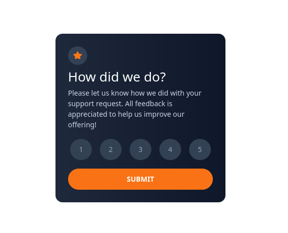

###Frontend Mentor - Interactive rating component solution

This is a solution to the [Interactive rating component challenge on Frontend Mentor](https://www.frontendmentor.io/challenges/interactive-rating-component-koxpeBUmI). Frontend Mentor challenges help you improve your coding skills by building realistic projects. 

### The challenge

Users should be able to:

- View the optimal layout for the app depending on their device's screen size
- See hover states for all interactive elements on the page
- Select and submit a number rating
- See the "Thank you" card state after submitting a rating

### Screenshot

### Links
It live on : [here](https://rateit.vercel.app)

view it on GitHub : [here](https://github.com/Govin-R/rating-fmentor)

### Steps
step 1: I crete required files for it.

step 2: I use tailwind-css, so setup it.

step 3: Next, make edit and commit.

step 4:	push on github, live on vercel.

### Learned with
Lots of basics learn with here,
I use tailwind for style, it make me feel free.

some javascript basics,DOM,css.

### Author 
Here you find me,

GitHub : [click](https://github.com/Govin-R/)

Twitter : [click](https://twitter.com/g_repl)

